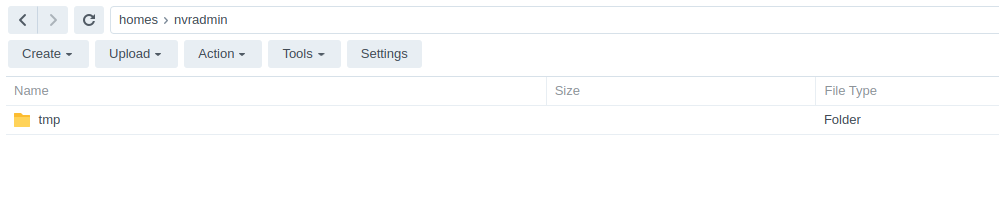
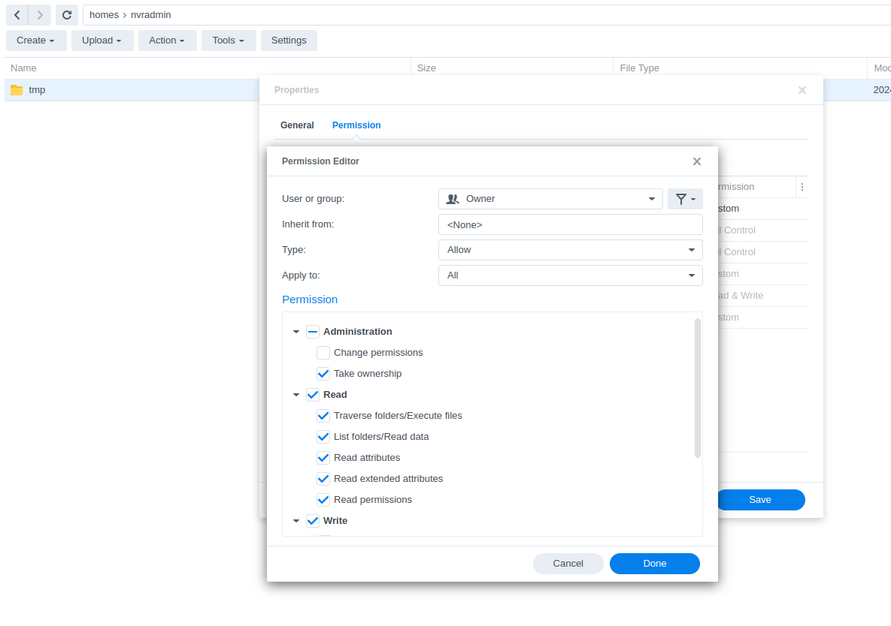
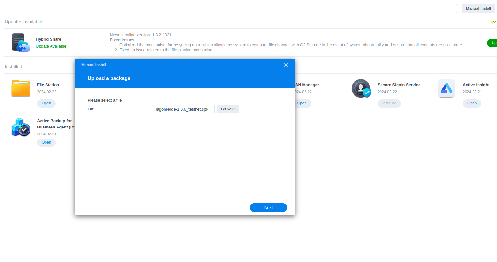
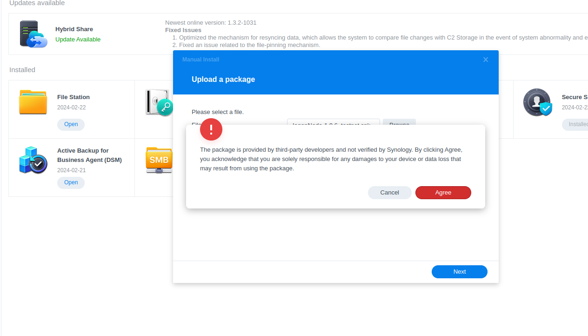
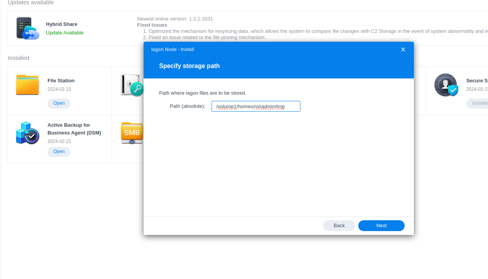
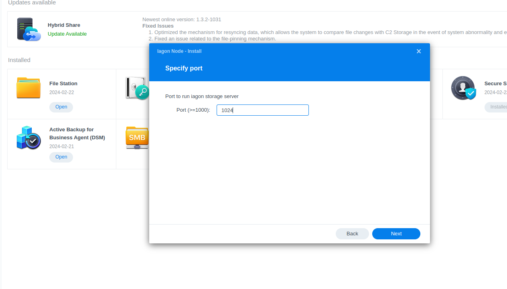
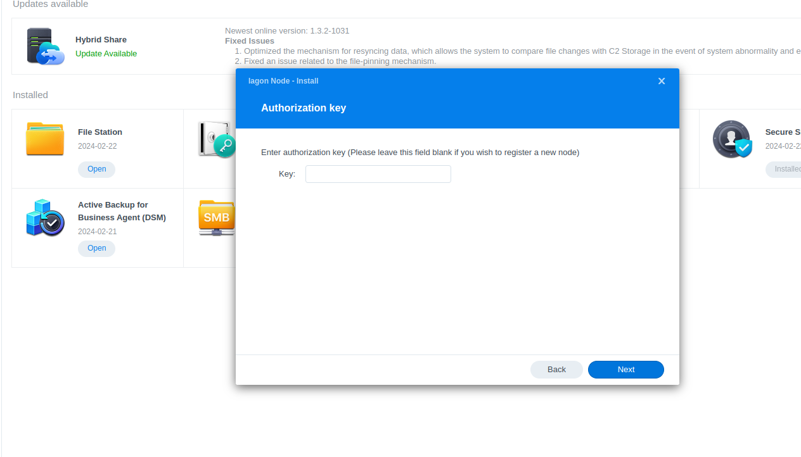
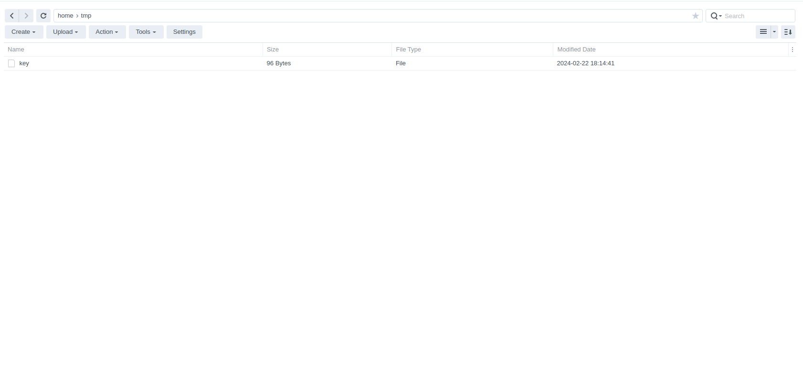
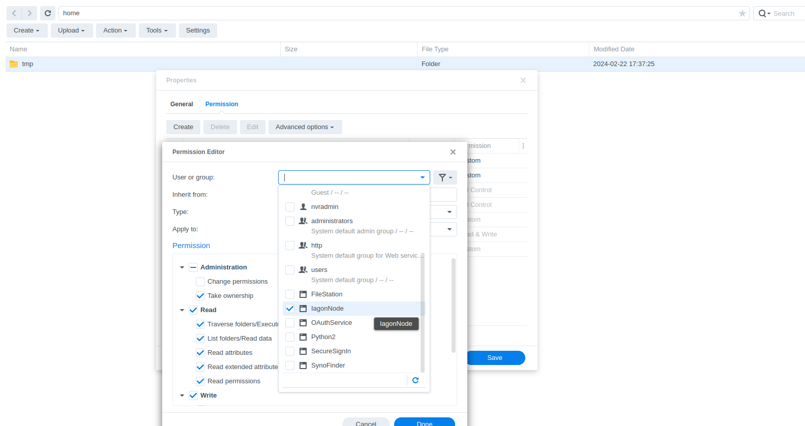
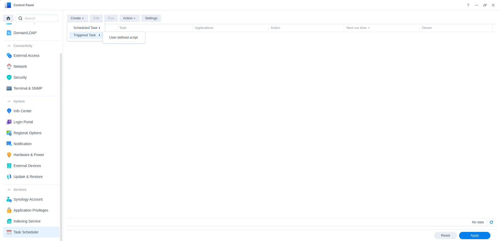

# Mainnet-Node-Synology

This is the repo for mainnet node synology. This uses preview network in cardano.

Preview dashboard link -> https://app.iagon.com/provider

# Pre-installation

1. Visit `https://github.com/Iagonorg/Mainnet-Node-Synology/releases/latest` to download the installation package for your NAS platform.

* What kind of CPU does your Synology NAS have?
[Link](https://kb.synology.com/en-us/DSM/tutorial/What_kind_of_CPU_does_my_NAS_have)

# Installation

1. Log in to DSM.
2. Create a folder where you want to store files for Iagon.

3. Change permissions to the folder just created.
    a. Right click and navigate to properties, and to the permissions tab.
    b. Click on create button to add new user/group.
    c. Select Everyone for user or group.
    d. Grant ‘Take ownership’ and Read/Write permissions and Save.

4. Go to the package center and select manual install and go through the wizard installation process
    a. Select the spk file for your synology device.

    b. Agree through the unsigned message popup.

    c. Enter the absolute path for the storage path and fill in the necessary inputs as prompted.

    d. Storage commitment in GB.

    e. Port.

    f. Enter an auth key if you already have one for the device; this is generally used for updates.

5. Once installed, you’ll be prompted with the auth-key after installation. The key will also be available in a file inside the storage path that you set during the installation process. *(Auth key is required to stake the node in the resource provider dashboard).

6. After the installation process is complete, change the permission of the folder that was committed to IagonNode, Follow the same step as step-3.

7. You can delete the Everyone permission from the list afterward.
8. Users can start/stop the IagonNode from the IagonNode tab inside the installed tab from the package center.

