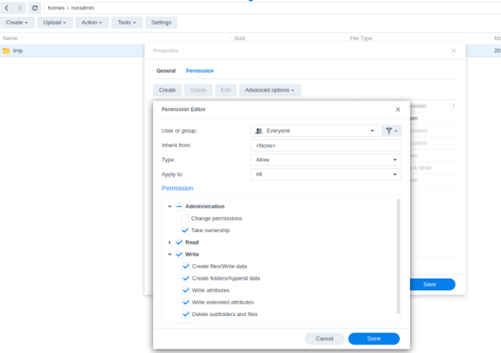
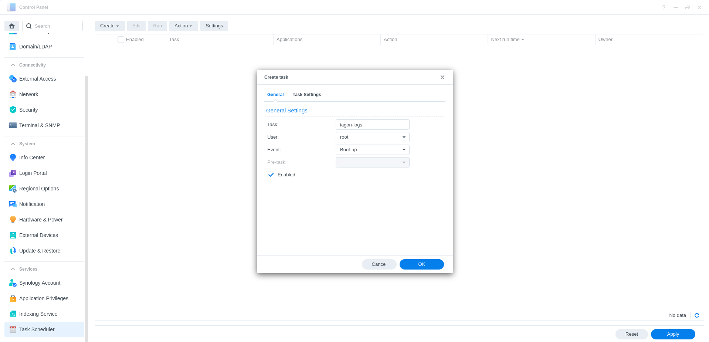
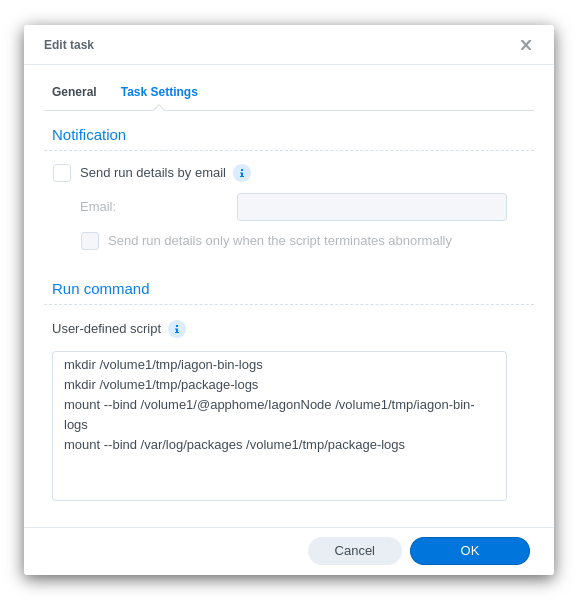
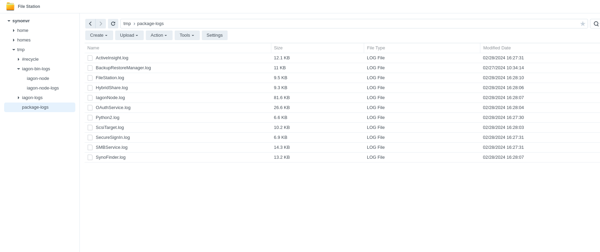
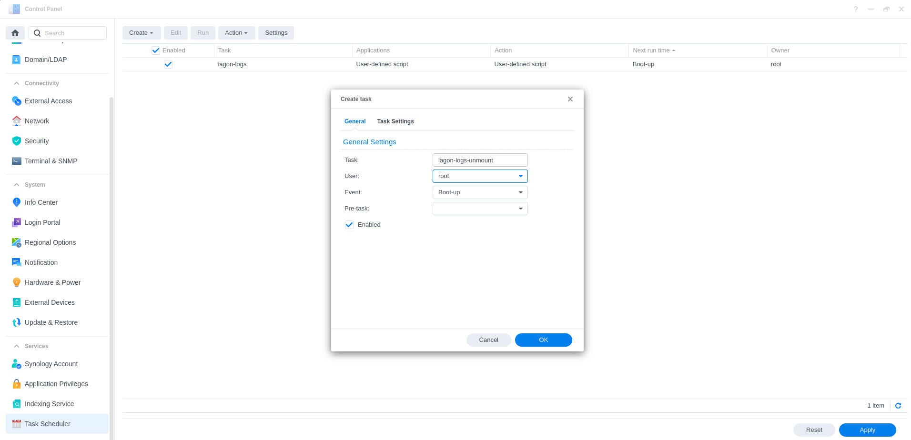
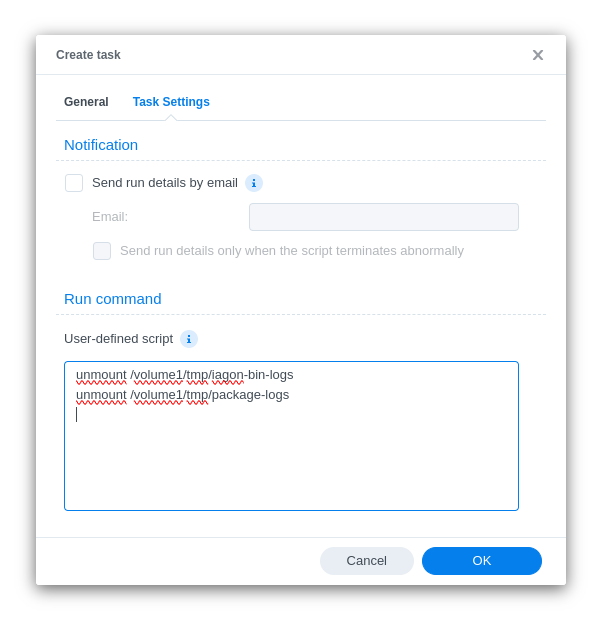
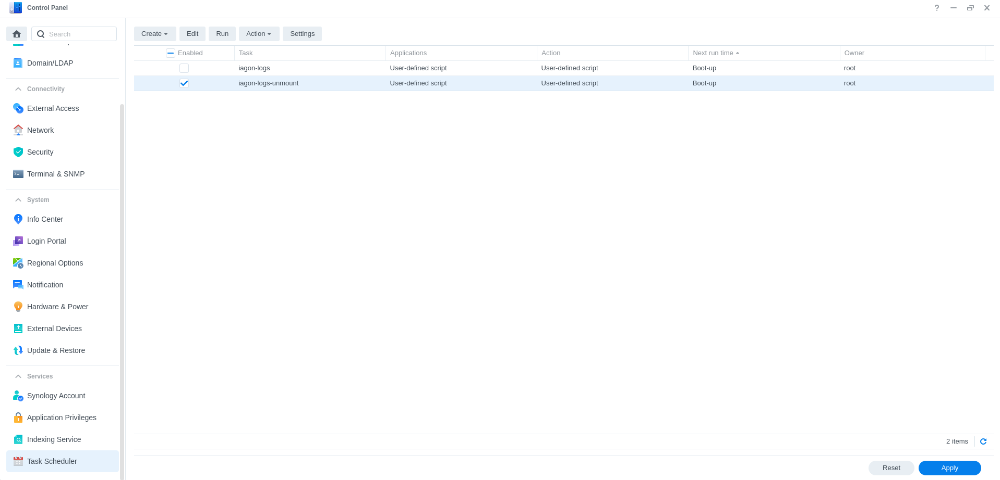

# Mainnet-Node-Synology

This is the repo for mainnet node synology.

# Pre-installation

1. Visit `https://github.com/Iagonorg/Mainnet-Node-Synology/releases/latest` to download the installation package for your NAS platform.

* What kind of CPU does your Synology NAS have?
[Link](https://kb.synology.com/en-us/DSM/tutorial/What_kind_of_CPU_does_my_NAS_have)

# Installation

1. Log in to DSM.
2. Create a folder where you want to store files for Iagon.


3. Change permissions to the folder just created. (If the folder is a sub-folder, give the same permissions to the parent folder)
    
    a. Right click and navigate to properties, and to the permissions tab

    b. Click on create button to add new user/group
    
    c. Select Everyone for user or group
    
    d. Grant ‘Take ownership’ and Read/Write permissions and Save



4. Go to the package center and select manual install and go through the wizard installation process

    a. Select the spk file for your synology device.


    b. Agree through the unsigned message popup.


    c. Enter the absolute path for the storage path and fill in the necessary inputs as prompted.


    d. Storage commitment in GB.


    e. Port.


    f. Enter an auth key if you already have one for the device; this is generally used for updates.


5. Once installed, you’ll be prompted with the auth-key after installation. The key will also be available in a file inside the storage path that you set during the installation process. *(Auth key is required to stake the node in the resource provider dashboard).


6. After the installation process is complete, change the permission of the folder that was committed to IagonNode, Follow the same step as step-3.


7. You can delete the Everyone permission from the list afterward.
8. Users can start/stop the IagonNode from the IagonNode tab inside the installed tab from the package center.


# View package installation and binary logs

Adopt following steps to view synology packages installation logs.

1. Open Task Scheduler from the services tab inside the DSM control panel.
2. Create a new Triggered Task (User-defined Script).



3. Give a name to the task, set the User to root and the Event to Boot-up.



4. Paste the script below in the User-defined script section in Task settings. (Ps. Mind the spaces between the paths specified)

```
mkdir /<volume>/<some-shared-folder>/iagon-bin-logs
mkdir /<volume>/<some-shared-folder>/package-logs
mount --bind /volume1/@apphome/IagonNode /<volume>/<some-shared-folder>/iagon-bin-logs
mount --bind /var/log/packages /<volume>/<some-shared-folder>/package-logs
```

- `<volume> = volume of the device, eg. volume1`
- `<some-shared-folder> = shared folder in the volume, eg. tmp`

5. Click Ok to save.




6. Reboot the system for the changes to take effect. After that you can see the folders being created in the shared-folder specified before.




- The installation logs can be found under the package-logs folder, named IagonNode.log 
- The logs related to the IagonNode itself can be found under iagon-bin-logs, the logs here are similar to that of iagon-node-cli.

*Note: It is always a good idea to unmount the system folders after use cases. For that you can create another Triggered Task (User-defined Script).

# Remove the logs

1. Create another Triggered Task (User-defined Script).



2. Paste the script below in the User-defined script section in Task settings. (Ps. Mind the spaces between the paths specified)

```
unmount /<volume>/<some-shared-folder>/iagon-bin-logs
unmount /<volume>/<some-shared-folder>/package-logs
```

- `<volume> = volume of the device, eg. volume1`
- `<some-shared-folder> = shared folder in the volume, eg. tmp`

3. Click Ok to save.



4. Reboot the system for the changes to take effect. After that you can see the folders inside being removed. 

*Note: Remember to uncheck the iagon-logs task before applying this iagon-logs-unmount task.


